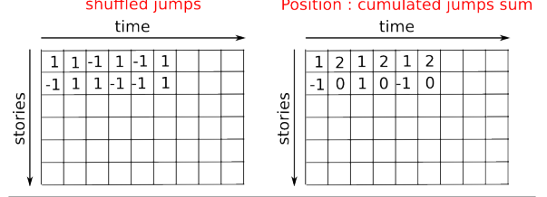

# diffusion using a random walk algorithm
 Using Numpy

### Question
Let us consider a simple 1D random walk process: at each time step a walker jumps right or left with equal probability.We are interested in finding the typical distance from the origin of a random walker after t left or rightjumps? We are going to simulate many “walkers” to find this law, and we are going to do so using arraycomputing tricks: we are going to create a 2D array with the “stories” (each walker has a story) in onedirection, and the time in the other

>Diagram 




```javascript
n_stories = 1000 # number of walkers
t_max = 200 # time during which we follow the walker
```

>We randomly choose all the steps 1 or -1 of the walk:


```javascript
t = np.arange(t_max)
steps = 2 * np.random.random_integers(0, 1, (n_stories, t_max)) - 1
np.unique(steps) # Verification: all steps are 1 or -1
```

>continuation.......

_Resulting plot_

